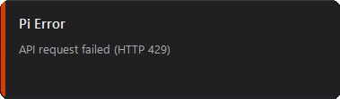
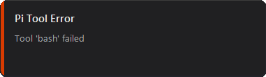
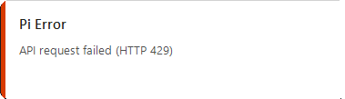
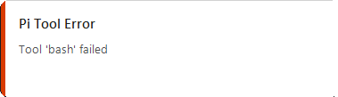

# pi-utilities

A collection of extensions, skills, and tools for [Pi](https://github.com/earendil-works/pi-coding-agent).

## Packages

### [@steven-rothwell/pi-notifier](./extensions/pi-notifier)

Windows desktop notifications for Pi. Get notified when the agent finishes, when API errors occur, or when tools fail.

- Agent finished alerts
- Provider error notifications (HTTP 4xx/5xx)
- Tool execution failure alerts
- Configurable sounds and themes
- Smart focus detection (suppresses when Pi is focused)

**Screenshots:**

| | Agent Finished | Provider Error | Tool Error |
|---|---|---|---|
| **Dark** |  |  |  |
| **Light** |  |  |  |

**Install:**

```bash
pi install npm:@steven-rothwell/pi-notifier
```

**Configure:**

```bash
/notifier
```

---

## Structure

```
pi-utilities/
├── extensions/           # Pi packages (npm-ready)
│   └── pi-notifier/      # Windows desktop notifications
│       ├── package.json
│       ├── README.md
│       └── notifier.ts
└── README.md
```

## License

MIT
